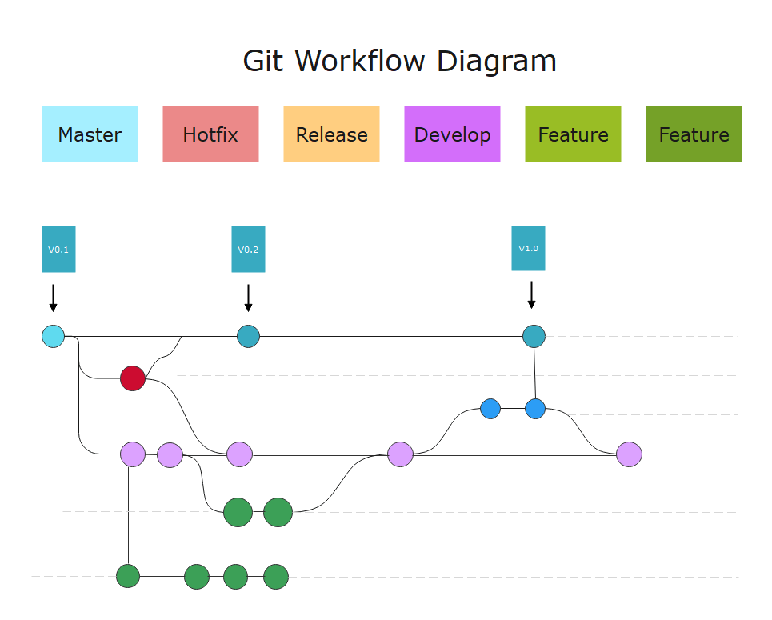
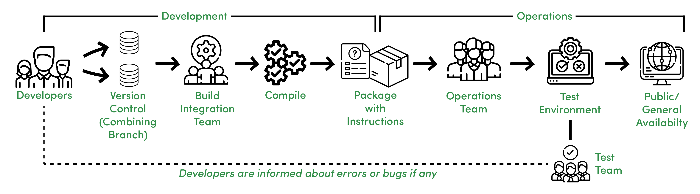

# Prudential_DevOps_Assignment

## 1.	What are the core DevOps responsibilities we normally carry?
### A:  We normally carry following responsibilities:
    -  Designing, building, testing, and maintaining the continuous integration and continuous delivery (CI/CD) process.
    -  Choosing the best tools and technologies the team requires to meet the business needs.
    -  Automating different phases of the DevOps pipeline.
    -  Monitoring systems for malicious activity.
    -  Integrating and connecting application elements (APIs, libraries, SDKs, etc.).

## 2.	Explain the concept of Git Flow using diagram.
### A: 
    - Let's assume that you work in a software development house, and your supervisor has assigned you a task, and now all your team members are working on the development branch. Directly from the develop branch, construct a feature branch for your assignment. Once you have finished your modifications, integrate your feature into the development branch. The main branch will be merged with the development branch by the deployment manager. The production servers use your main branch.
  
    - Hotfixes are applied directly to the Main branch. This structure shows what happens after a release candidate build is made, including a branch for automatic nightly builds, branches for features worked in parallel on the developers' private branches, and what happens after a release candidate build is created. As you can see, development branching methods can get pretty complicated. When they're visualized, they're a lot easier to follow.
  
    - Hotfix branches are employed to patch production releases swiftly. The only branch that should fork directly from the main is this one. The patch should be merged into both main and developed as soon as possible, and the main should be labeled with an updated number.

## 3.	Demonstrate how CI/CD tool makes integration and deployment more efficient and reliable.
### A:  CI/CD allows organizations to ship software quickly and efficiently. CI/CD facilitates an effective process for getting products to market faster than ever before, continuously delivering code into production, and ensuring an ongoing flow of new features and bug fixes via the most efficient delivery method. 
