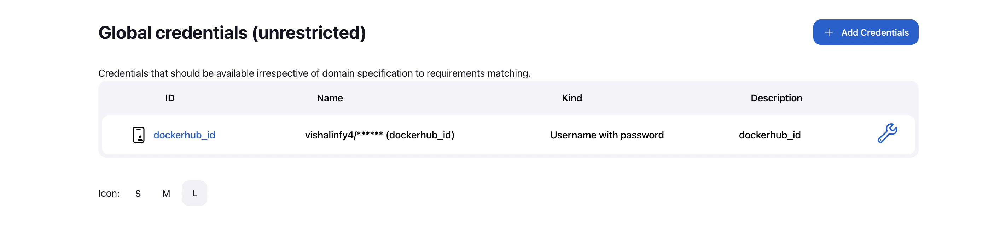
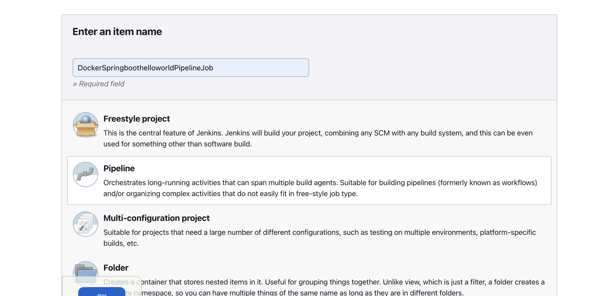

## Tool used for CICD - **Jenkins**

### Steps followed
- Setup `docker credentials` in Jenkins
  

- Create a pipeline job in Jenkins
  

- Create a [Jenkinsfile](jenkinsfile) for the pipeline

- Build the pipeline
  
- Access the `Spring-boot-hello-world` application